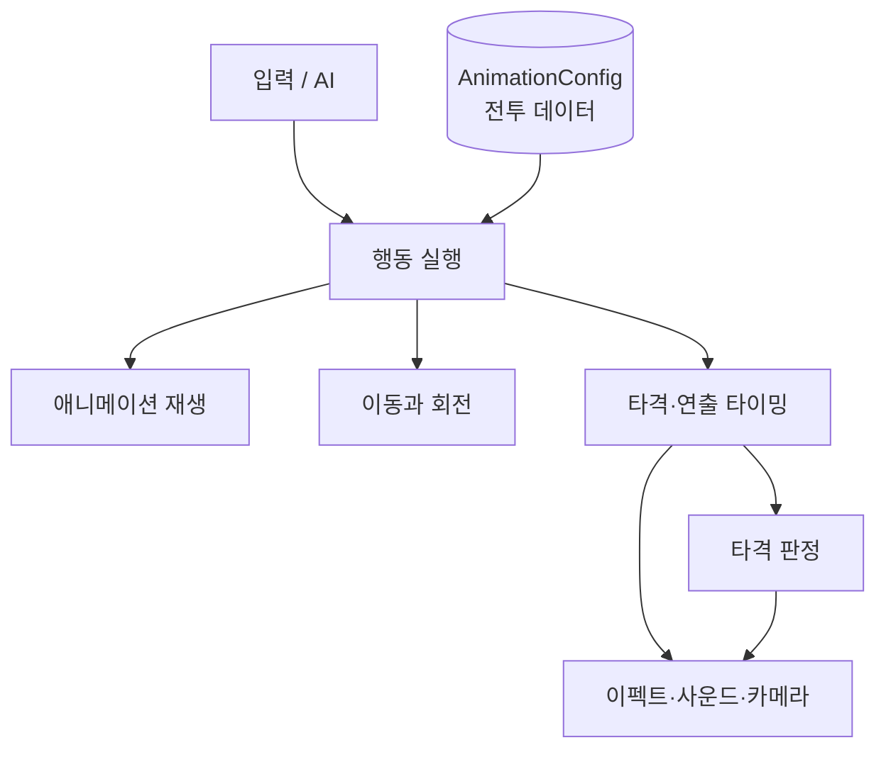

# ZZZ Combat Animation System

> Unity 6 기반 3인칭 액션 전투·애니메이션 프로토타입
>
> 전투 동작을 코드에 하드코딩하지 않고, 데이터와 전용 에디터 도구로 제작·확장할 수 있도록 설계했습니다.


<!-- 대표 영상 추가 예정: Documentation/Images/gameplay.gif -->

## 📋 1. 프로젝트 개요

| 항목 | 내용 |
|---|---|
| 프로젝트 | ZZZ Combat Animation System |
| 장르 | 3인칭 액션 전투 프로토타입 |
| 개발 기간 | 2026.07 ~ 진행 중 |
| 엔진 | Unity 6000.3.16f1 / URP 17.3.0 |
| 개발 언어 | C# |
| 현재 범위 | 전투 실행 프레임워크, 전용 제작 도구, 타격 판정 및 전투 피드백 |

Animator Controller에 전투 전이와 조건을 쌓는 대신, `AnimationConfig` ScriptableObject가 콤보·회피·패링·피격의 흐름을 소유합니다. `CharacterActionRunner`는 이 데이터를 해석하고, Animator는 `CrossFade`를 통한 클립 재생에 집중합니다.

### 핵심 목표

- 공격 타이밍과 전이 조건을 데이터로 제작해 새로운 행동 추가 시 코드 수정을 줄입니다.
- 플레이어와 몬스터가 동일한 행동 실행기를 사용하도록 공용 경계를 설계합니다.
- 애니메이션, 판정, 이펙트와 사운드를 한 타임라인에서 조정하고 미리 확인합니다.
- 풀링과 명확한 생명주기 관리를 통해 반복 재생되는 전투 연출을 안정적으로 회수합니다.

> 현재 전투 프레임워크와 제작 도구는 구현되어 있으며, 적 AI·체력·경직·사망을 연결한 완성형 전투 루프와 대표 영상은 제작 중입니다.

## 🎮 2. 핵심 구현

### 2.1 데이터 기반 전투 애니메이션

**문제**

Animator Controller에 콤보 조건, 입력 윈도우와 전투 기능이 분산되면 행동 하나를 수정할 때 여러 전이와 코드를 함께 추적해야 합니다.

**구현**

- `Section`: 재생할 클립, 속도와 루트 모션 설정
- `Link`: 다음 Section과 전이 조건, 입력 가능 구간 설정
- `Notify`: 특정 시점의 타격·이펙트·사운드·카메라 요청
- `SectionModule`: 이동·회전·타깃 보정·무적·패링 기능을 구간 단위로 조합

새로운 조건은 `LinkCondition`, 새로운 구간 기능은 `SectionModule`, 외부 요청은 `NotifyPayload` 구현으로 확장합니다. 공유 실행기에 타입별 분기문을 계속 추가하지 않아도 기능을 조합할 수 있습니다.

[상세 문서: 전투 애니메이션 아키텍처](Documentation/AnimationArchitecture.md)

### 2.2 전용 전투 데이터 제작 도구

`AnimationConfigTool`은 런타임 데이터 모델을 그대로 편집하는 Unity Editor 도구입니다.

- Section, Link, Notify와 Module을 하나의 타임라인에서 편집
- 콤보 전이, 루트 모션과 복합 이펙트 미리보기
- Scene View에서 Sphere·Cone·Box·Capsule 판정 범위 편집
- Play Mode에서 현재 Config, Section, 입력 상태와 판정 범위 확인
- normalized time으로 저장하고 제작 화면에서는 애니메이션 프레임으로 변환해 표시

`EffectTool`에서는 여러 VFX 프리팹의 지연, 소켓, 위치와 동작 모듈을 하나의 `CompositeEffect`로 구성하고 독립적으로 미리 재생할 수 있습니다.

<!-- 에디터 도구 GIF 추가 예정: Documentation/Images/animation-tool.gif -->

### 2.3 조합형 이펙트와 프리팹 단위 풀링

하나의 공격 연출은 여러 이펙트를 서로 다른 시점과 위치에서 재생하지만, 같은 원시 프리팹은 여러 공격에서 재사용됩니다.

- 게임 로직은 조합 데이터인 `CompositeEffect`만 요청합니다.
- `EffectService`는 각 Entry를 펼쳐 프리팹별 `EffectPool`에서 인스턴스를 대여합니다.
- `PooledEffectHandle`이 재생 종료, 상태 복원과 원래 풀로의 반환을 책임집니다.
- `EffectOriginKey`로 이동 중인 빔·파티클의 실제 Transform과 타격 판정을 동기화합니다.

조합 단위의 제작 편의성과 프리팹 단위의 메모리 관리를 분리한 구조입니다.

[상세 문서: 이펙트 아키텍처](Documentation/EffectArchitecture.md)

### 2.4 판정과 전투 피드백 분리

`HitService`는 범위 검사와 결과 전달만 담당합니다. 실제 이펙트, 충돌음, 카메라와 히트스톱은 판정 결과를 받은 별도 서비스가 처리합니다.

- 근접·구·부채꼴·박스·캡슐 및 Sweep 판정 지원
- `Ignored`, `Parried`, `Accepted` 결과에 따른 피드백 분기
- 공격 강도와 피격 결과 조합을 `HitFeedbackProfile` 데이터로 선택
- 공격 경고와 실제 타격 시점을 분리해 퍼펙트 회피·패링 성공 판정
- Animation Notify가 카메라 구현을 직접 참조하지 않는 서비스 경계 구성

[상세 문서: 전투 피드백 아키텍처](Documentation/CombatFeedbackArchitecture.md)

### 2.5 캐릭터 교체와 입력 소유권

입력 장치와 카메라는 씬의 `PlayerRuntime`이 한 번만 소유합니다. `SquadController`가 활성 캐릭터를 교체하며 입력 대상과 카메라 타깃을 함께 이전합니다.

교체 시 기존 행동 실행기를 종료하고 진행 중인 이펙트·사운드·타격 Handle을 정리한 뒤 새 캐릭터의 기본 Config를 시작합니다. 캐릭터 프리팹은 자신의 애니메이션 설정과 전투 상태만 독립적으로 보관합니다.

[상세 문서: 플레이어 런타임 및 스쿼드 구조](Documentation/PlayerRuntimeArchitecture.md)

## 🧩 3. 시스템 구조



입력과 AI는 행동 실행을 요청하고, `AnimationConfig`는 실행할 전투 데이터를 제공합니다. 실행기는 애니메이션·이동·타이밍을 제어하며, 실제 판정과 연출은 독립된 서비스가 처리합니다.

## 🔧 4. 기술적 문제 해결

### 루트 모션 회전이 이중으로 적용되는 문제

**문제:** 180도 TurnBack 애니메이션에서 최상위 캐릭터와 하위 본의 회전이 함께 적용되어 모델이 360도 도는 현상이 발생했습니다.

**해결:** `Root`와 `Bip001` 중 실제 회전 델타가 발생하는 본을 런타임에 선택하고, 해당 회전을 최상위 오브젝트의 월드 yaw로 전달했습니다. 동시에 하위 본에는 넘긴 누적 yaw만큼 역보정을 적용해 시각적 이중 회전을 제거했습니다.

**결과:** 애니메이션의 회전 궤적을 유지하면서 캐릭터 진행 방향을 정확히 180도 전환하고, 다음 Run Section까지 자연스럽게 연결했습니다.

### 상태 전환 중 이펙트가 중복되거나 조기에 종료되는 문제

**문제:** 동일 Section 재진입과 분기 전환 과정에서 지속 이펙트가 매 루프마다 다시 생성되거나 목적지에 도달하기 전에 종료될 수 있었습니다.

**해결:** Effect Notify에 `Keep`, `Stop`, `Next` 전환 정책을 두고 실제 Section 이탈과 목적지 일치 여부를 기준으로 소유권을 관리했습니다. Self-link는 이탈로 취급하지 않고 진행 중인 Handle과 예약 상태를 유지합니다.

**결과:** 루프와 분기가 섞인 강화 공격에서도 이펙트의 생성·유지·종료 시점이 애니메이션 상태와 일치합니다.

### 풀링된 이펙트의 상태와 판정 수명 관리

**문제:** 풀 인스턴스에 이전 재생의 Transform·파티클·머티리얼 상태가 남거나, 이동 이펙트가 반환된 뒤에도 연결된 타격 판정이 유지될 수 있었습니다.

**해결:** 재생 상태를 에셋에서 분리해 인스턴스별 Runner가 관리하고, 모든 종료 경로를 `PooledEffectHandle`로 모았습니다. 반환 전 상태를 복원하며, `EffectOriginKey` Binding 해제와 연결된 Hit 종료도 같은 생명주기에서 처리합니다.

**결과:** 같은 프리팹을 여러 조합에서 반복 사용하면서도 이전 재생 상태가 다음 요청에 누수되지 않도록 했습니다.

## 🛠️ 5. 기술 스택

| 구분 | 기술 |
|---|---|
| Engine | Unity 6000.3.16f1 |
| Rendering | Universal Render Pipeline 17.3.0 |
| Language | C# |
| Input | Unity Input System 1.19.0 |
| Camera | Cinemachine 3.1.4 |
| Navigation | AI Navigation 2.0.12 |
| Test | Unity Test Framework 1.6.0 |
| Version Control | Git / GitHub |

## 🎹 6. 조작법

| 입력 | 동작 |
|---|---|
| `WASD` / 방향키 | 이동 |
| 마우스 이동 | 카메라 |
| 마우스 왼쪽 버튼 / `Enter` | 기본 공격 |
| 마우스 오른쪽 버튼 / `Left Shift` | 회피 |
| `Space` | 패링 |
| `E` | 강화 공격 |
| `1` / `2` | 이전 / 다음 캐릭터 교체 |

## ▶️ 7. 실행 방법

> 현재 별도 배포 빌드는 제공하지 않으며 Unity Editor에서 실행합니다.

1. Unity Hub에서 프로젝트를 Unity `6000.3.16f1`로 엽니다.
2. `Assets/99.Scenes/SampleScene.unity`를 엽니다.
3. Play Mode를 실행해 전투 기능을 확인합니다.

## 📂 8. 프로젝트 구조

```text
Assets/
├── 01.Characters/          캐릭터, 애니메이션과 AnimationConfig 데이터
├── 02.Effects/             VFX 프리팹과 CompositeEffect 데이터
├── 04.Scripts/
│   ├── Core/               공용 애니메이션 데이터와 행동 실행기
│   ├── Agent/              플레이어 조작 캐릭터
│   ├── Monster/            몬스터 동작
│   ├── Combat/             타격 판정과 피드백
│   ├── Effects/            이펙트 재생과 풀링
│   └── Player/             입력 라우팅과 캐릭터 교체
├── 05.Editor/              AnimationConfigTool과 EffectTool
├── 99.Scenes/              실행 씬
└── Tests/EditMode/         순수 C# 및 에디터 테스트
```

## 📚 9. 기술 문서

- [전투 애니메이션 아키텍처](Documentation/AnimationArchitecture.md)
- [이펙트 아키텍처](Documentation/EffectArchitecture.md)
- [전투 피드백 아키텍처](Documentation/CombatFeedbackArchitecture.md)
- [플레이어 런타임 및 스쿼드 구조](Documentation/PlayerRuntimeArchitecture.md)
- [주요 설계 결정](Documentation/자료구조_선택.md)
- [강화 공격 상태 제어](Documentation/EnhanceStateControl.md)
- [개발 로드맵](Documentation/TODO.md)

## 🗺️ 10. 다음 목표

- 적 AI, 체력·경직·사망을 연결한 플레이 가능한 전투 수직 단면 완성
- 전투 → 타임라인 편집 → 실행 결과를 보여주는 60~90초 대표 영상 제작
- 전이, 타격 판정과 이펙트 생명주기 EditMode 테스트 보강
- 실행 가능한 PC 빌드 제공
- Profiler 기반 성능 측정과 풀링 효과 수치화
